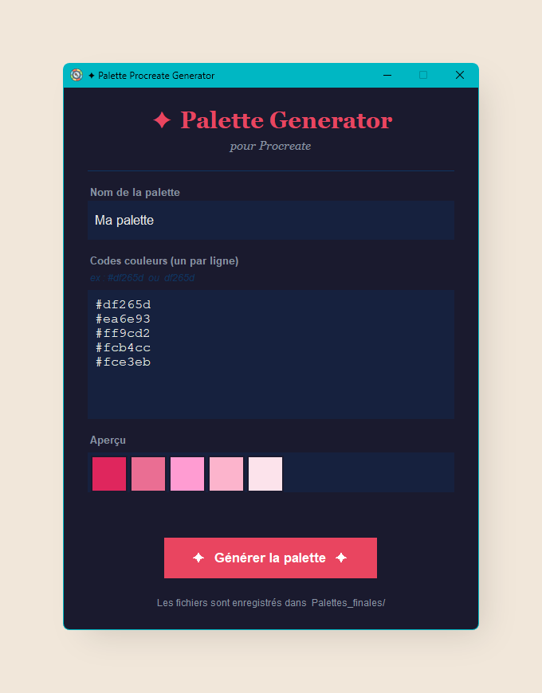

# ✦ Palette Generator for Procreate

A lightweight Python desktop app to generate `.swatches` color palette files, ready to import directly into **Procreate**.



---

## What does it do?

Got a list of hex color codes (e.g. `#df265d`) and want to turn them into a Procreate palette without the hassle?

Launch the app, paste your codes, name your palette, click **Generate** — done.

---

## Features

- Clean and simple graphical interface
- Paste hex codes with or without `#`
- Real-time color preview
- One-click `.swatches` file generation
- Files saved automatically in a `Palettes_finales/` folder
- Custom icon in the Windows taskbar

---

## Installation

No complex setup required. You just need **Python** installed on your computer.

1. Download or clone this repository
2. Place all files in the same folder
3. Double-click `palette_app.pyw`
4. The app opens 🎉

> **Note:** All libraries used (`tkinter`, `json`, `zipfile`, `os`, `re`, `ctypes`) are included with Python by default. Nothing extra to install.

---

## Usage

1. **Palette name** : type the name you want to give your palette
2. **Color codes** : paste your hex codes, one per line
3. The preview updates automatically
4. Click **✦ Generate palette ✦**
5. Your `.swatches` file is created in the `Palettes_finales/` folder

Just import it into Procreate and you're good to go!

---

## Project structure

```
📁 your-folder/
├── palette_app.py      → full source code (logic + interface)
├── palette_app.pyw     → launcher without terminal window (double-click)
├── favicon.ico         → application icon
└── Palettes_finales/   → folder created automatically on first use
```

---

## Credits

This project is based on the original work by [M4nw3l](https://github.com/M4nw3l/PyProcreatePalette), released under the MIT license.

Windows adaptation and graphical interface developed by [Kaellyana](https://github.com/kaellyana), with the help of [Claude](https://claude.ai) (Anthropic).

---

## License

MIT — free to use, modify and redistribute with credit to the original authors.
